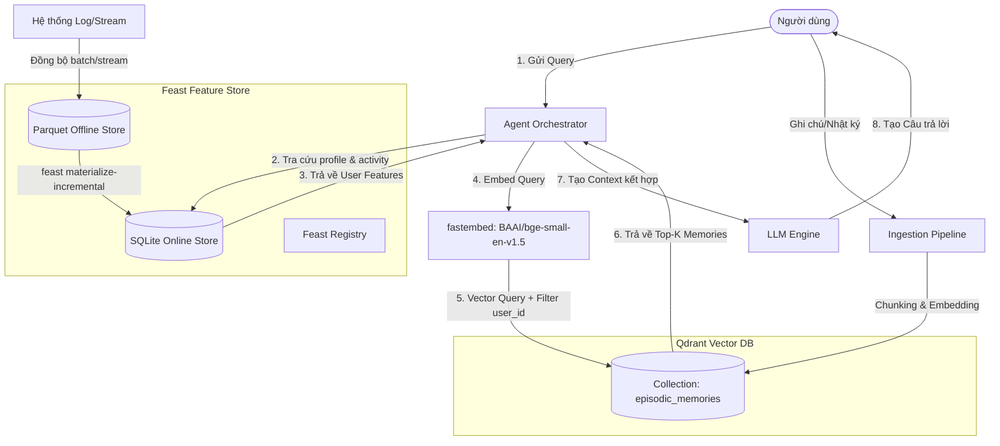

# Kiến trúc Hệ thống Hybrid Memory (Vector Store + Feature Store)

Tài liệu này mô tả thiết kế kiến trúc và các quyết định kỹ thuật cốt lõi cho hệ thống bộ nhớ lai (Hybrid Memory System) của Trợ lý AI cá nhân tại Việt Nam, kết hợp thông tin ngữ cảnh dài hạn (episodic memory) và hồ sơ người dùng động (user profile & behavior state).

---

## 1. Sơ đồ kiến trúc (Architecture Diagram)

Sơ đồ Mermaid dưới đây thể hiện luồng dữ liệu khi người dùng gửi một câu truy vấn (Query) đến hệ thống trợ lý cá nhân.

---

## 2. Ba quyết định thiết kế cốt lõi & Trade-offs

### Quyết định 1: Chiến lược Phân mảnh (Chunking Strategy) cho Episodic Memory
Hệ thống sử dụng chiến lược **Sentence-level & Paragraph-level Hybrid Chunking** (phân mảnh kết hợp cấp câu và cấp đoạn văn). Cụ thể, các tài liệu ghi chú dài được tách thành các đoạn văn tự nhiên (dựa trên dấu xuống dòng kép `\n\n`), và mỗi đoạn văn được giới hạn tối đa 500 ký tự (khoảng 100-150 từ). Nếu một đoạn văn quá ngắn, nó sẽ được gộp với đoạn tiếp theo.

*   **Trade-off (Chất lượng Tìm kiếm vs Chi phí Lưu trữ vs Context Window):**
    *   **Per-sentence (Tách theo câu):** Cho kết quả embedding rất chi tiết nhưng làm mất ngữ cảnh xung quanh (contextual loss), dẫn đến việc LLM nhận được các câu rời rạc.
    *   **Per-conversation (Tách theo hội thoại):** Giữ nguyên ngữ cảnh hội thoại nhưng số lượng token lớn làm loãng vector embedding (diluted vector semantic), giảm độ chính xác khi tìm kiếm chi tiết.
    *   **Lựa chọn đoạn ngắn (100-150 từ):** Là điểm ngọt (sweet spot). Nó đủ ngắn để biểu diễn semantic vector sắc bén mà không bị loãng, đủ dài để chứa một ý hoàn chỉnh, giúp tiết kiệm dung lượng của Qdrant Index đồng thời không chiếm quá nhiều không gian trong Context Window của LLM.

### Quyết định 2: Lược đồ Đặc trưng (Feature Schema) của User Profile
Chúng tôi lựa chọn **Tabular Features** (các thuộc tính dạng bảng tường minh như `reading_speed_wpm`, `preferred_language`, `topic_affinity` dạng chuỗi) thay vì **Embedding-based Profile Features** (vector biểu diễn sở thích ngầm).

*   **Trade-off (Tính dễ giải thích & Kiểm soát vs Khả năng biểu diễn ngầm):**
    *   **Embedding Profile Features:** Rất mạnh để cá nhân hóa ngầm (implicit personalization) thông qua tích chập sở thích người dùng, nhưng là một "hộp đen" (black box) hoàn toàn. Rất khó để giải thích tại sao hệ thống recommend tài liệu này, và cực kỳ khó để người dùng chủ động chỉnh sửa sở thích của mình.
    *   **Tabular Features:** Giúp hệ thống rõ ràng, minh bạch. Nhà phát triển có thể viết các câu prompt tường minh (ví dụ: `[User preference: cloud, preferred language: vi]`) giúp LLM tuân thủ chỉ thị tốt hơn. Ngoài ra, việc lưu trữ dạng bảng giúp Feast và SQLite hoạt động cực kỳ nhẹ nhàng, giảm thiểu độ trễ truy vấn xuống dưới 2ms (so với việc phải tính toán khoảng cách vector trên một không gian embedding người dùng riêng biệt).

### Quyết định 3: Chiến lược Làm mới Dữ liệu (Freshness Strategy)
Chúng tôi phân tầng chiến lược làm mới dữ liệu thành 3 cấp độ tương ứng với 3 nhóm tính năng:
1.  **Gần thời gian thực (Sub-second / Streaming Update):** Áp dụng cho `queries_last_hour` và `distinct_topics_24h` (sử dụng Feast Streaming Source kết hợp Redis/SQLite). Việc này là bắt buộc để trợ lý nhận diện ngay lập tức nếu người dùng đang spam câu hỏi hoặc đột ngột thay đổi chủ đề nghiên cứu.
2.  **Định kỳ 1 giờ (Hourly Batch Materialization):** Áp dụng cho các tính năng thống kê hiệu năng đọc hoặc cập nhật nhẹ về `topic_affinity` dựa trên các tương tác gần nhất.
3.  **Hằng ngày (Daily Materialization):** Áp dụng cho các thông tin nhân khẩu học chậm thay đổi như `preferred_language` hoặc cập nhật hệ số tốc độ đọc trung bình dài hạn.

*   **Trade-off (Độ trễ Dữ liệu vs Chi phí Hạ tầng & Tính toán):**
    *   Nếu đưa toàn bộ profile lên Streaming Pipeline, chi phí duy trì Apache Flink / Kafka và ghi liên tục vào database sẽ cực kỳ tốn kém và gây nghẽn cổ chai ghi (write bottleneck).
    *   Bằng cách phân tầng, chúng ta chỉ streaming các chỉ số hoạt động siêu nhẹ (ví dụ: query counters) và giữ các chỉ số nặng (như tính toán lại phân bố sở thích trên hàng ngàn tương tác) ở mức offline/batch daily. Điều này đảm bảo hệ thống phản hồi cực nhanh mà chi phí vận hành vẫn tối ưu.

---

## 3. Quyết định Loại bỏ Giải pháp Thay thế (Rejected Alternative)

Chúng tôi đã xem xét giải pháp **Lưu trữ toàn bộ Episodic Memory trực tiếp bên trong Feature Store** (dưới dạng một Feature View chứa danh sách các văn bản hoặc danh sách vector). 

*   **Lý do loại bỏ:**
    1.  **Sự khác biệt về chu kỳ thay đổi (Update Cycles):** Episodic Memory thay đổi liên tục theo từng câu nói của user. Việc ghi chèn liên tục các đoạn text dài vào một Feature Store dạng bảng sẽ làm phình to database online (SQLite/Redis) một cách không cần thiết, làm giảm hiệu năng của các truy vấn profile vốn yêu cầu độ trễ < 5ms.
    2.  **Khả năng tìm kiếm tương đồng (Semantic Search):** Feature Store không được thiết kế cho việc tìm kiếm vector khoảng cách lớn (ANN Search). Việc cố gắng tích hợp tìm kiếm vector trên các trường dữ liệu của Feast sẽ biến nó thành một cơ sở dữ liệu vector kém hiệu quả. Do đó, việc tách biệt rõ ràng: **Feast cho thuộc tính dạng bảng có cấu trúc** và **Qdrant cho dữ liệu vector phi cấu trúc** là giải pháp tối ưu nhất.

---

## 4. Xem xét bối cảnh Tiếng Việt (Vietnamese Context Considerations)

Khi thiết kế Trợ lý AI cho người dùng Việt Nam, có 3 yếu tố NLP đặc thù cần giải quyết:

1.  **Hiện tượng Code-switching (Trộn lẫn ngôn ngữ Vi-Anh):** Người Việt trong ngành công nghệ thường xuyên viết các câu pha trộn, ví dụ: *"Config Kubernetes cluster bị lỗi timeout"*.
    *   *Giải pháp:* Lựa chọn embedding model đa ngôn ngữ như `BAAI/bge-small-en-v1.5` hoặc tốt hơn là `bge-m3` trong production. Các model này được pre-train trên cả corpus tiếng Việt và tiếng Anh, giúp liên kết từ *"triển khai"* của tiếng Việt với *"deploy"* của tiếng Anh trên cùng một không gian vector.
2.  **Công cụ tách từ (Tokenizer Choice):** Tiếng Việt là ngôn ngữ đơn lập, ranh giới từ không trùng với khoảng trắng (ví dụ: *"điện toán đám mây"* là 1 từ gồm 4 tiếng).
    *   *Giải pháp:* Với BM25, việc sử dụng `whitespace split` (như trong lab) sẽ làm giảm hiệu năng tìm kiếm lexical. Ở production, hệ thống cần tích hợp các thư viện tokenizer chuyên dụng như **PyVi** hoặc **Underthesea** để phân tách từ chính xác (biến *"điện toán đám mây"* thành *"điện_toán đám_mây"*), giúp BM25 tính toán chỉ số IDF chính xác hơn.
3.  **Lỗi gõ dấu tiếng Việt (Telex/VNI typos):** Người dùng Việt Nam rất dễ gõ sai dấu hoặc thiếu dấu do xung đột bộ gõ (ví dụ: *"hoạt"* thành *"hoatj"* hoặc *"hoat"*).
    *   *Giải pháp:* Trước khi đưa query vào Qdrant/BM25, cần đi qua một module **Text Normalization** nhẹ để tự động khôi phục dấu và sửa các lỗi gõ Telex phổ biến nhằm tăng độ chính xác của tìm kiếm Lexical.

---

## 5. Đánh giá Vibe-Coding

Quá trình phát triển hệ thống POC này thể hiện rõ triết lý Vibe-Coding:
*   **Phần AI tự động hóa:** Các đoạn code khởi tạo Qdrant Client, cấu hình Feast FeatureStore, hay viết khung vòng lặp tìm kiếm trong `agent.py` và `demo.py` hoàn toàn là các boilerplate lặp đi lặp lại được AI sinh cực kỳ nhanh và chính xác.
*   **Phần Kỹ sư tập trung:** Kỹ sư phải tự tư duy về cấu trúc Context được trả về, cách thiết lập payload filter trong Qdrant để cô lập dữ liệu giữa các người dùng (`user_id` isolation), cấu hình TTL phù hợp cho các Feature View trong Feast để tránh lỗi rò rỉ dữ liệu (data leakage) trong các tác vụ phân tích lịch sử, và cách xử lý lỗi mã hóa ký tự (Unicode) trên Windows.
